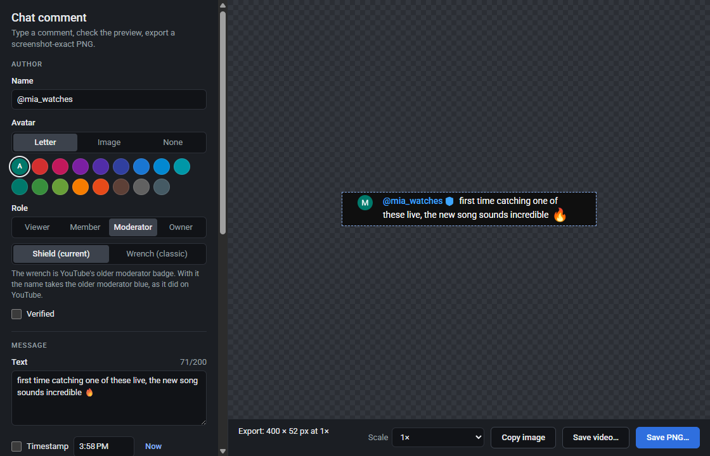
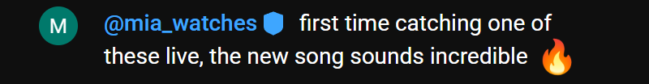
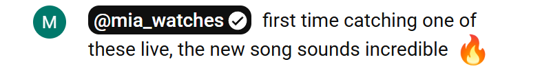

# YouTube Chat Comment

A desktop app that makes a picture of a YouTube **live-chat comment**: type a name and a message, and it
renders the comment exactly as YouTube's live chat does, then exports it as a PNG that matches a Snipping
Tool screenshot of that comment, or as a video of the message typing itself out.

<p align="center"></p>

Two exports, made at 2× and shown at half size:

<p></p>
<p></p>

It is meant for mock-ups, thumbnails, video edits and demos. It is not affiliated with or endorsed by
YouTube or Google, and a comment made with it should not be presented as something a real person said.

## Running it

Built and tested on Windows 11: the export matches a Windows screenshot, ClearType text and all. It should
also run from source on macOS and Linux, but that hasn't been tested there, and the packaged build is
Windows-only.

You need [Node.js](https://nodejs.org) 22.12 or newer, and an internet connection the first time a message
uses an emoji (the images come from Google's servers on demand).

```sh
npm install
npm start
```

Launch through `npm start` (or `node scripts/electron.js .`) rather than `npx electron .`: the launcher
removes `ELECTRON_RUN_AS_NODE`, which some tools (e.g. VS Code extensions) set and which would otherwise
make Electron run as plain Node.

### Build an executable

```sh
npm run dist
```

This writes two versions of the app to `dist/`:

- `YouTube-Chat-Comment-1.0.0-portable.exe`: one file you can keep and run anywhere. It unpacks itself
  each time it starts, so it opens a few seconds slower.
- `win-unpacked/`: the same app as a folder; `YouTube Chat Comment.exe` inside starts instantly.

The executable isn't code-signed, so on another PC Windows SmartScreen may ask before the first run
(More info → Run anyway). The version number comes from `package.json` and the icon from `build/icon.png`
(drawn from `build/icon.svg`).

## What you can set

- **Name and message**: the name is shown exactly as typed (YouTube shows `@handles`, and some older
  accounts still show a display name). Emoji in the message follow YouTube's own emoji list (Noto 15.1):
  everything on it, including symbols such as ♥ © ™, is drawn with the same Noto images YouTube uses, and
  newer emoji stay text, as they do on YouTube. Without internet the images fall back to your system's
  emoji font, and the preview says so.
- **Avatar**: a YouTube-style default avatar (a coloured square with the first letter, shown as a circle),
  or any picture: choose a file or drop it on the window. Like YouTube, the app draws avatars from a 32 px
  image at up to 1.33× scale and from a 64 px one above that. **None** crops the avatar out, as if your
  snip started just right of it: the image begins where the avatar ended and the line breaks don't change.
- **Role**: viewer, member (green name, plus your channel's badge image if you add one; YouTube has no
  stock member badge), moderator (blue name with the shield badge, or YouTube's classic wrench badge with
  its older blue) or owner (highlighted name), plus a verified tick.
- **Theme**: dark or light chat.
- **Timestamp**: hidden by default, as in YouTube's live chat; it follows the clock until you edit it.
- **Comment width**: line breaks depend on how wide the chat is. YouTube's standard chat gives 385 px rows;
  wider windows and theater mode give wider rows (400 px, the default). Adjust it until the line breaks
  match what you see on YouTube.
- **Margin**: extra chat background around the comment, like a looser snip.
- **Scale**: defaults to your display's scale factor, which is what a screenshot of your screen contains.
  Pick 1×, 1.5×, 2×… for other sizes.

Export with **Save PNG…** (Ctrl+S) or **Copy image** (Ctrl+Shift+C).

## Typing video

**Save video…** (Ctrl+Shift+S) exports an MP4 (H.264) in which the message types itself out one character
at a time (an emoji counts as one character), with the name, avatar and badges there from the start:

- **Typing speed**: 1–60 characters per second.
- **Start delay** and **Hold at end**: how long the empty comment shows before typing starts, and how long
  the finished comment stays.
- **Frame rate**: 30 or 60 fps.

**Preview typing** plays it in the preview. Every frame is captured exactly like the PNG export (same scale
and settings), so the video shows the same pixel-faithful comment; as the text wraps, the row grows
downwards, and the frame size is that of the finished comment.

## How it stays faithful

The comment is real YouTube markup styled by YouTube's own CSS, not an imitation:

- `src/comment/render.js` builds the same DOM YouTube's chat produces (elements, classes, attributes,
  even the zero-width spaces between the name and the message).
- `src/styles/youtube-chat.css` is the part of YouTube's chat stylesheet that applies to a message row,
  with its colour variables resolved for the dark and light themes; `src/styles/roboto.css` loads the
  same Roboto v48 font files YouTube's chat uses (bundled in `src/assets/fonts`).
- `src/stage/stage.html` reproduces the chat page around the row. The editor previews it, and export
  captures that same page from Chromium's compositor at the chosen scale (`electron/capture.js`).

## Tests

- `npm test`: unit tests (emoji handling, text limits, typing timing, HTML escaping, the generated markup).
- `npm run test:visual`: the golden test, which compares the app's output with real YouTube rows pixel by
  pixel. It needs a YouTube live-chat page saved by a browser, which isn't in the repository (it would
  contain other people's comments): open a live stream in Chrome or Edge, let the chat fill, then
  *Save page as… → Webpage, Complete* into `yt_example_page/`. The test finds the chat document
  (`saved_resource*.html` inside the saved `…_files` folder), screenshots real chat rows (plus owner,
  member, verified, timestamp, light-theme, classic-moderator and cropped-avatar variants made from them),
  renders the same comments with the app and compares the images. The cases in `CASES` refer to rows of
  the page the app was developed against (which row has a moderator, emoji, three lines…), so adjust them
  for your own page. Against that page, all 100 cases are identical at 1×, 1.25×, 1.5× and 2×. The test
  skips itself when no saved page is present.
- `node scripts/electron.js test/smoke/capture.js`: the capture pipeline (sizes at every scale, queueing,
  timeouts, crash recovery).
- `node scripts/electron.js test/smoke/app.js`: the whole app, run hidden: editing, saving, copying, a
  typing video (checked by reading the MP4 back), restoring saved settings, and the security checks.

YouTube's emoji list is bundled in `src/comment/youtube-emoji.js`; `node scripts/update-emoji.js [url]`
regenerates it from the list YouTube's chat loads.

## Project layout

```
electron/     main process: windows, IPC, the app:// protocol, capture
src/editor/   the editor window
src/stage/    the page the comment is rendered (and captured) in
src/comment/  markup, emoji, badges and avatars
src/styles/   YouTube's chat CSS and the Roboto font faces
test/         unit tests, smoke tests and the visual golden test
docs/         the images in this README
```

## Licence

The app's own code is under the [MIT License](LICENSE). It also contains or uses:

- the markup and CSS rules of YouTube's live chat, reproduced in `src/comment/render.js` and
  `src/styles/youtube-chat.css` so that the comment renders identically; they belong to YouTube/Google;
- [Roboto](https://fonts.google.com/specimen/Roboto) (Google), bundled in `src/assets/fonts` under its
  own licence;
- Noto Emoji images, loaded at run time from Google's servers, the way YouTube's chat loads them;
- [Electron](https://www.electronjs.org/) (MIT) and [Mediabunny](https://mediabunny.dev/) (MPL-2.0), which
  encodes the MP4.
